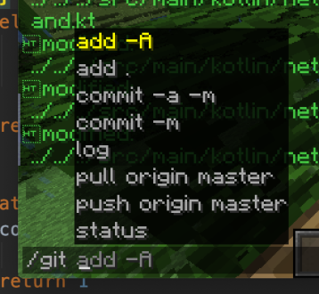

# Git Mod - A Fabric Mod written in Kotlin

A server-side git client usable within minecraft chat!

To use, navigate to the config folder and locate the `gitmod.json` configuration file. Here, you can define a gitPath (automatically the `datapacks` folder) and a dictionary of operators (name: UUID) for people who are allowed to utilize the git system. 

Then, you can type `/gitconfig reload` to reload the config.

Now you can type `/git` and any sort of git command and it *should* just work!
Even aliases!

## Setup

0. Make sure you have Git installed are you system and available through your $PATH. If you are on Windows, it's very likely this mod will fail :(.

1. Install this Mod along side fabric-language-kotlin

2. Run the server / client to create an empty configuration file `config/gitmod.json`

3. Edit the config to specify your git repo and the operator's UUID you would like to adjust

		{
			"gitPath": "path to git repo (defaults to datapacks folder)",
			"operators": {
				"minecraft name": "minecraft UUID"
			}
		}

4. ???

?. Success?

## Details

At the moment, this is an incredibly cursed mod. Essentially, it takes the arguments of the `/git` cmd and passes it a shell process to run it in a coroutine. If a command is currently running (like a `git pull`), then no other invocations are allowed. This design is extremely restricted to avoid any weird bugs that might come up.

Also, this mod will heavily rely on your personal git installation since it leverages your shell. In the future, the plan is to develop a client `/git` cmd and a `/gitraw` cmd where `/git` interfaces with the JGit library and `/gitraw` works thru the shell process. For now, we have jank :D.

Do note that when working with services like `github`, you'll have to work with some sort of authentication to get your `git` to operate with `github` w/o you inputting a password into minecraft (since that will be blocked). This will involve some sort of ssh key or something, so do be aware. I suggest you gave the `git` installation on the server some sort of special email and username to differentiate from normal commits to your repo!

## Why?

This mod is geared towards datapackers. When working on a server, it is not always possible to have an SFTP connection to access and work with the files. This means you might have to edit the files through a HTTPS panel which can be incredibly frustrating. SFTP also has a lue of issue and is not always reliable especially when trying to collaborate with others (like datapack jams). Since `git` is a popular tool and already used in the space, a tool like this can be incredibly helpful and potent.

For example, when working on a datapack ran server, you can have a bunch of experiemental changes applied on a branch and then switch back to your main branch to avoid pollution. It's also extremely viable to have your entire local setup work seemlessly with the server since you can just spam `git commits` as a way of timestamping your changes and pushing to your server.

## License

This project is licensed under the MIT licenses. Any exceptions for this license are detailed in licensing in specific files.
